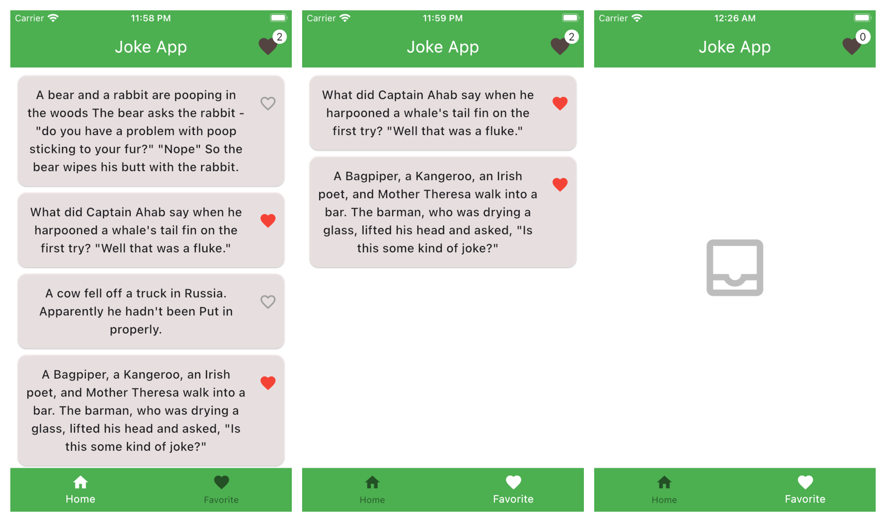

# riverpod-joke-app

A Flutter project about clean architecture and state managment with riverpod and efficient tools.

## Getting Started

This project is a starting point for a Flutter application with riverpod.

development content:

- clean architecture
- custom widgets
- bottom navigation tab and navigation with go_router
- riverpod state management 
- used some usefull package like freezed and flutter-script and also flutter_screenutil

